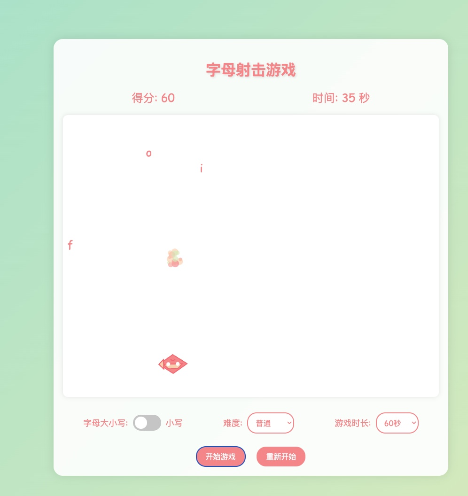

# 字母射击游戏 (Letter Fire)

一个有趣的HTML5 Canvas打字练习游戏，适合儿童和打字初学者。通过击打下落的字母来提高打字速度和准确性。

## 功能特点

- 简单直观的游戏玩法：输入键盘字母发射子弹，击中对应的下落字母
- 三种难度级别：适合不同水平的玩家
- 可选择大小写字母模式
- 可自定义游戏时长
- 随着游戏进行，难度逐渐增加
- 精美的视觉效果和声音反馈

## 如何游玩

1. 选择游戏设置（难度、大小写、游戏时长）
2. 点击"开始游戏"按钮
3. 当字母从屏幕上方落下时，在键盘上按下对应的字母
4. 飞机会自动移动到字母下方并发射子弹
5. 成功击中字母可获得分数
6. 在游戏时间结束前尽可能多地获取分数

## 技术栈

- HTML5 Canvas
- JavaScript (ES6+)
- CSS3

## 开发说明

项目使用纯JavaScript开发，无需任何外部库或框架。所有游戏逻辑都在`game.js`文件中实现。

### 文件结构

- `index.html` - 主HTML文件
- `style.css` - 样式表
- `game.js` - 游戏核心逻辑
- `assets/` - 游戏音效和资源

### 本地运行

只需在浏览器中打开`index.html`文件即可开始游戏。无需服务器或特殊配置。

## 学习价值

这款游戏旨在帮助儿童和初学者以有趣的方式提高打字能力：

- 练习键盘字母识别
- 提高打字速度和准确性
- 增强手眼协调能力
- 通过游戏化方式保持学习动力

## 下一步计划

- 添加更多视觉效果和动画
- 实现得分排行榜
- 添加特殊字母和能力提升
- 创建移动设备触摸版本

## 许可

[MIT](LICENSE) 